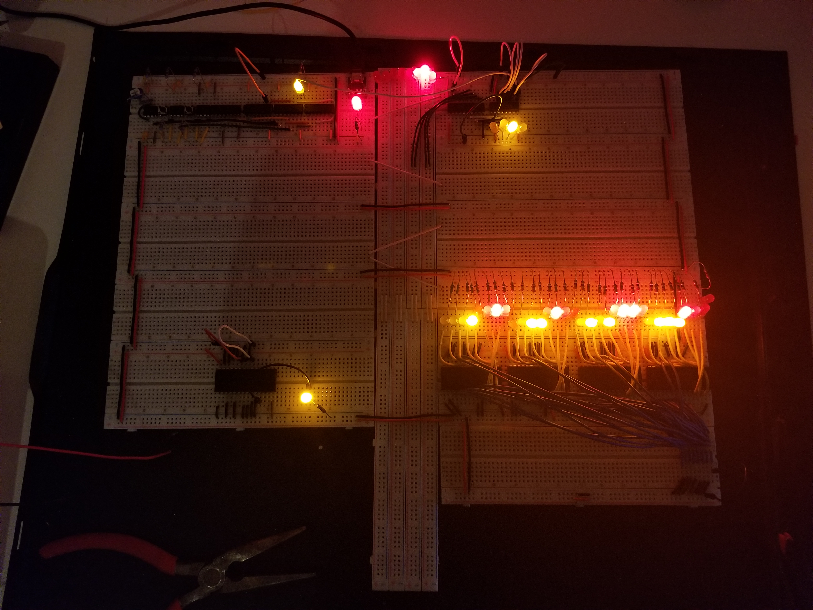
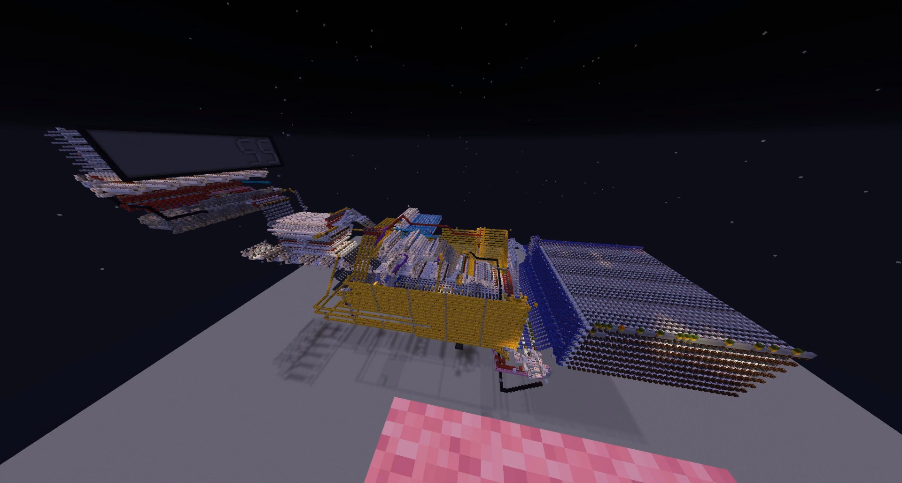

# 8-Bit CPU Documentation [WIP]

This project aims to document how my 8-bit CPU works, to provide example programs that it can run, and to provide visual examples of those programs running.

## Inspiration
The design of this CPU was heavily inspired by ideas from both Ben Eater's ["Building an 8-bit breadboard computer!" Youtube series](https://www.youtube.com/watch?v=HyznrdDSSGM&list=PLowKtXNTBypGqImE405J2565dvjafglHU) and Marco Schweighauser's [Online Assembler-Simulator](https://schweigi.github.io/assembler-simulator/index.html)

## Implementations
### Breadboard [WIP]


### Redstone [Completed]

[link to video](https://youtu.be/lqPx-vPoeg0)

## Block Diagram


### Colors
```
Blue:     component
Red:      register controlled by micro code which saves data from bus, and constantly outputs it into the component to it's right
Green:    input label
Purple:   resticts or allows data to flow from a component, to the central bus
Yellow:   8-Bit data bus
Orange:   Multiplexer
```

### Components
```
ALU       Performs arithmetic and bitwise operations on integer binary numbers
REGs      General purpose registers which hold data for a CPU to preform computation on
ND        7-segment number display
ID        Instruction Decoder given assembly instructions to be executed
IP        Instruction Pointer which points to the instruction to be executed in memory
RAM       Memory which holds program instructions and data
IF        determins if a selected flag is true or false and notifies the Instruction Pointer
```
